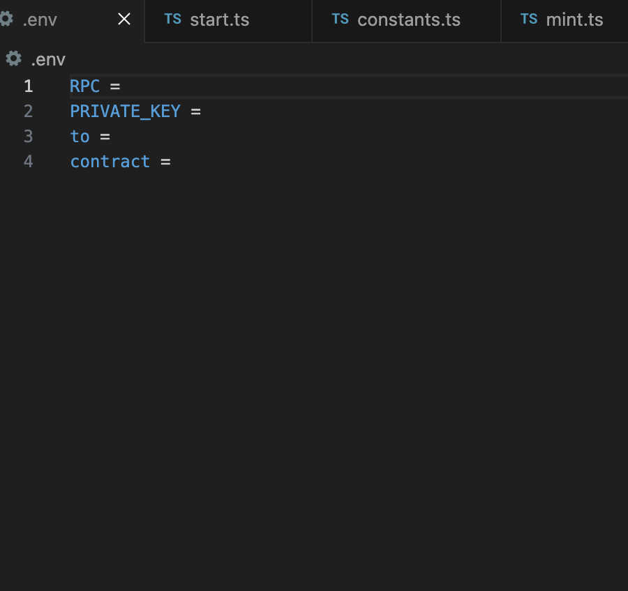

# Ethereum Nonce PoW Miner Program

This Ethereum Nonce PoW Miner Program is a Node.js command-line application that enables users to interact with Ethereum wallets and perform PoW mining.

## Features

**Wallet Management**: Manage Ethereum wallets, including viewing wallet information, creating new wallets, and setting up existing accounts.

**Mining**: Engage in Ethereum Nonce PoW Mining by providing a mining address.

## Risk Disclaimer

Please note that this tool does not provide the capability to track mining progress or verify if a specific tick has been successfully minted. For this information, visit [Nonce Official Website](). Use this tool with the understanding that it does not provide real-time updates on the availability of mining opportunities. Users are advised to proceed with caution and at their own risk.

## Installation

### Prerequisites

Before installing the program, ensure you have Node.js installed on your system. If not, follow these steps to install Node.js:

1. Visit [Node.js official website](https://nodejs.org/).
2. Download the Node.js installer for your operating system.
3. Follow the installation instructions to install Node.js and npm.

### Setting Up the Program

Once Node.js is installed, you can set up the Ethereum Nonce PoW Mining Program:
To use this program, ensure you have Node.js installed on your system. Clone the repository and install dependencies:

```bash
git clone https://github.com/noncePow/mint-tool
cd mint-tool
npm i 
```

## Usage

### Quick Start

1. Modify configuration information

- You can use the default rpc or replace it
- RPC = 
- Use the private key of your mining account
- PRIVATE_KEY = 
- Receiving address for mint inscriptions
- to = 


2. pow mine

```shell
npm run start <times>
```

### Mining Commands

Start Mining: npm run start <times>

- Start mining by specifying the number of times.
